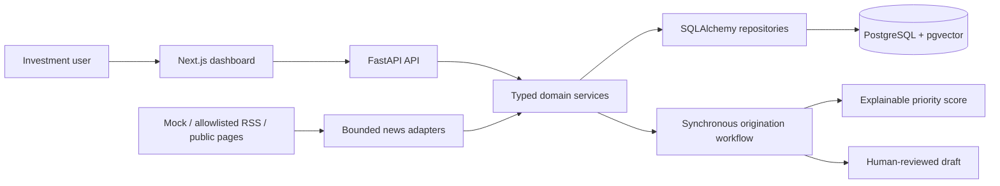

# Private Equity Origination Agent Platform

A full-stack, offline-first prototype that turns fragmented company, CRM, news
and internal-document context into explainable target priorities and
human-reviewed outreach drafts.

**[中文详细说明](README_ZH.md)**

> This README is the public landing page, not the implementation specification.
> Scope and evidence are governed by the
> [final implementation plan](docs/FINAL_IMPLEMENTATION_PLAN.md),
> [architecture decisions](docs/ARCHITECTURE_DECISIONS.md) and
> [implementation status](docs/IMPLEMENTATION_STATUS.md).

## Why this project

Private-equity origination teams repeatedly combine CRM history, public market
signals and internal research before deciding which companies deserve attention
and why. This project packages that workflow into a reviewable product rather
than an autonomous investment or email-sending system.

The verified product supports:

- target-company monitoring and company detail views;
- mock CRM contacts and interaction history;
- offline mock news ingestion plus opt-in, server-allowlisted RSS/public pages;
- versioned positive and negative business-trigger extraction;
- company-scoped document retrieval with PostgreSQL/pgvector;
- source-grounded RAG with citations and prompt-injection safeguards;
- explainable CRM/trigger-aware priority scores;
- editable outreach drafts that remain subject to human review.

## Verified status

Milestones 0–3 are complete and checkpoint-verified. They form the public
snapshot in this repository. Milestone 4 has an approved design and local work
in progress, but its implementation has not passed the milestone checkpoint and
is intentionally excluded from this public snapshot.

Latest completed checkpoint evidence:

- **154** backend unit/integration tests passed;
- **89%** backend line coverage;
- Alembic downgrade/upgrade/schema-drift matrix passed on isolated PostgreSQL;
- frontend ESLint, TypeScript and Next.js production build passed;
- isolated Compose API/Web/news/trigger flows passed;
- zero required test skips.

Exact commands, counts and limitations are recorded in
[docs/IMPLEMENTATION_STATUS.md](docs/IMPLEMENTATION_STATUS.md).

## Architecture



Current CRM and document access use direct service/repository adapters.
LangGraph orchestration and MCP transport are roadmap items, not verified M3
runtime capabilities. News synchronization is an explicit API/CLI action; there
is no scheduler or background daemon.

## Product surface

| Area | Route | Purpose |
|---|---|---|
| Dashboard | `/` | Portfolio, workflow and draft overview |
| Companies | `/companies` | Target list and workflow entry point |
| Company detail | `/companies/[companyId]` | News, CRM, documents and RAG context |
| News | `/news-articles` | Ingested company signals |
| Triggers | `/triggers` | Extracted positive/negative events |
| CRM | `/crm` | Contacts and interaction history |
| Documents | `/documents` | Mock internal-document library and preview |
| RAG Explorer | `/rag` | Company-scoped retrieval and citations |
| Agent Runs | `/agent-runs` | Synchronous workflow execution history |
| Drafts | `/drafts` | Draft editing and review status |

## Tech stack

- **Frontend:** Next.js 16, React 19, TypeScript, Tailwind CSS, shadcn/ui
- **Backend:** Python 3.12, FastAPI, Pydantic 2, SQLAlchemy 2
- **Data:** PostgreSQL 16, pgvector, Alembic
- **Retrieval:** deterministic hashing embeddings; optional pinned offline
  `all-MiniLM-L6-v2` cohort
- **Quality:** pytest, pytest-cov, ESLint, TypeScript, Docker Compose

## Quick start

Prerequisites: Docker/Compose, Python 3.12, Node.js and pnpm.

1. Create local configuration and replace every password placeholder:

   ```bash
   cp .env.example .env
   ```

2. Start PostgreSQL and create the disposable demo/test database:

   ```bash
   docker compose up -d postgres
   docker compose exec -T postgres createdb -U pe_agent pe_agent_test
   ```

3. Install and run the API against the disposable database:

   ```bash
   cd apps/api
   python3 -m venv .venv
   source .venv/bin/activate
   pip install -r requirements.txt

   set -a
   source ../../.env
   set +a

   DATABASE_URL="$TEST_DATABASE_URL" python -m scripts.migrate
   python scripts/seed_data.py --database-url "$TEST_DATABASE_URL"
   DATABASE_URL="$TEST_DATABASE_URL" python scripts/index_documents.py
   DATABASE_URL="$TEST_DATABASE_URL" uvicorn main:app --reload
   ```

4. Run the frontend in another terminal:

   ```bash
   cd apps/web
   pnpm install
   pnpm dev
   ```

Open [http://localhost:3000](http://localhost:3000). API documentation is at
[http://localhost:8000/docs](http://localhost:8000/docs).

The default hashing path needs no model download, LLM key or internet access.
For the optional pinned MiniLM provider, keep the model cache outside this
repository and follow the commands in [README_ZH.md](README_ZH.md#11-本地运行).

## Development checks

```bash
make test
make lint
cd apps/web && pnpm exec tsc --noEmit
cd apps/web && pnpm build
docker compose config --quiet
git diff --check
```

Tests must use an isolated database whose name contains `test`. Never run seed,
migration-downgrade or reset commands against a long-lived database.

## Safety and limitations

- Demo records and internal documents are deterministic mock data.
- External content is treated as untrusted input.
- Network news sources require explicit server-owned HTTPS allowlists.
- No authentication, role-based authorization or multi-tenant isolation exists.
- No real CRM/Egnyte connection or real email delivery is enabled.
- Scores support decision-making; they are not investment advice.
- Dedicated frontend component/browser automation remains future work.

## Documentation

- [Detailed Chinese product overview](README_ZH.md)
- [Frontend guide](apps/web/README.md)
- [Final implementation plan](docs/FINAL_IMPLEMENTATION_PLAN.md)
- [Architecture decisions](docs/ARCHITECTURE_DECISIONS.md)
- [Implementation status and test evidence](docs/IMPLEMENTATION_STATUS.md)
- [Repository execution rules](AGENTS.md)

## License

See [LICENSE](LICENSE).
