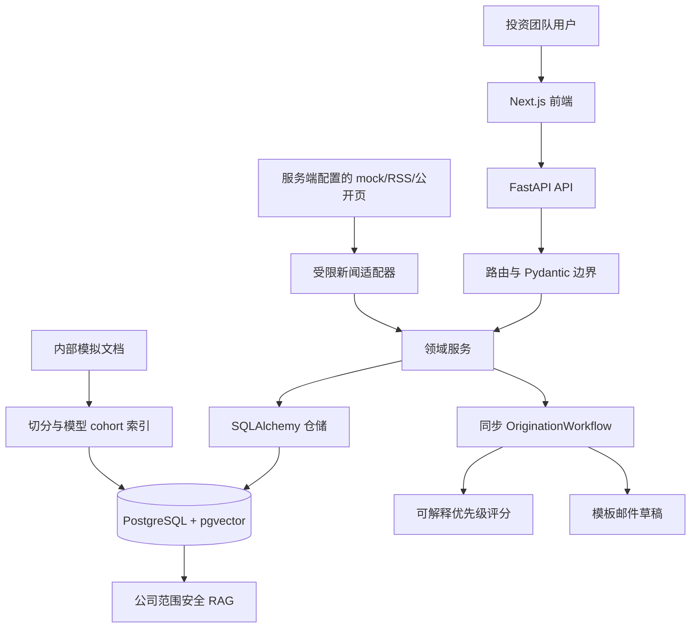

# 私募股权项目发掘智能体平台

面向私募股权（Private Equity）项目发掘团队的全栈工作流原型。平台将目标公司、CRM 关系、公开新闻和内部文档上下文汇总为可解释的优先级评分，并生成需要人工审核的外联邮件草稿。

**[English overview](README.md)**

> 本文件是详细的中文产品概览、安装说明和演示入口，不是权威实施规范，也不能替代详细实施计划。工程范围、里程碑与完成定义以 [最终实施计划](docs/FINAL_IMPLEMENTATION_PLAN.md) 为准；已确认决策见 [架构决策](docs/ARCHITECTURE_DECISIONS.md)，实际进度和测试证据见 [实施状态](docs/IMPLEMENTATION_STATUS.md)。如 README 与更高优先级文档冲突，应先报告冲突、确认实施决策，再同步更新 README。

## 1. 当前状态

里程碑 0–3 已完成并通过检查点，也是本公开仓库快照中最后一个经过完整
验证的实现范围。里程碑 4 已完成设计并在本地实施中，但尚未通过里程碑
检查点，因此其源代码、迁移、测试和 Compose 配置不包含在本次公开快照中，
也不能作为已完成功能宣传。

当前代码已经验证的能力：

- Next.js 16、React 19 和 TypeScript 前端；
- FastAPI、Pydantic 2 和 SQLAlchemy 2 后端；
- PostgreSQL 16 与 pgvector 数据库；
- 公司、新闻、触发事件、CRM、文档、向量检索、智能体运行和邮件草稿 API；
- Alembic 基线与加法迁移，覆盖空库、既有基线库、完整无版本 M1 库和旧 `create_all()` 半迁移库；
- 隔离测试数据库、数据库身份防误用护栏，以及 154 个后端单元/集成测试；
- 投资授权、公司管线、反馈、审计列表、运行步骤和邮件修订历史 API；
- `/health`、`/ready`、集成健康、结构化 request/run ID 日志、Docker 健康检查和非 root 生产镜像；
- 默认 384 维确定性哈希向量，以及可选、固定 revision、纯离线加载的
  MiniLM 语义提供者；不同提供者/模型/version/dimension 的向量 cohort
  严格隔离；
- 必须指定公司的安全 RAG：文档类型/相似度过滤、上下文和 top-k 上限、
  来源多样性、结构化引用、提示注入处理与摘要式审计；
- 默认纯离线的 mock 新闻源，以及受服务端 source registry 和精确 HTTPS
  域名白名单约束的 RSS/公司公开新闻页适配器；
- 手动 API/CLI 新闻同步、幂等新闻入库、带版本生命周期的批量提取，以及
  14 类标准正负触发事件；可选 hybrid LLM 仅作受验证的规则补充并安全回退；
- 同步的 `v3-crm-trigger-aware` 评分和邮件草稿工作流；
- 可解释评分原因、证据引用和 CRM/触发事件上下文；
- 模板式邮件草稿和人工编辑/状态更新；
- 覆盖 6 家公司、2 个投资授权、18 份文档、18 条去重新闻以及
  高/中/低、负面、空结果和安全场景的可重复 JSON 演示数据；
- 后端测试覆盖率 89%，前端 ESLint、TypeScript 与生产构建检查通过。

尚未实现、不能当作现有能力宣传的内容：

- 前端组件/浏览器自动化测试；
- 投资授权、管线、审计、反馈、集成健康和运行步骤详情前端页面；
- 真正的本地 CRM/文档 MCP server-client 边界；
- LangGraph 节点、条件路由、持久化步骤和审批暂停/恢复；
- 强制的邮件发送状态机，以及超出当前持久化/API 基础的反馈分析看板。

## 2. 产品定位

私募股权项目发掘团队通常需要在多个系统中追踪大量目标公司：

- CRM 中的联系人、历史沟通和关系强度；
- 公司网站、新闻和行业信息；
- 内部投资备忘录、市场研究和会议记录；
- 人工维护的目标清单、跟进任务和交易阶段。

平台围绕三个业务问题组织信息：

1. 现在最值得关注哪家公司？
2. 为什么是现在？
3. 下一步应该联系、跟进、研究、观察、暂缓还是放弃？

目标是减少重复的信息搜集与整理工作，为投资团队提供有证据、可解释、可人工复核的决策支持，而不是替代投资判断。

## 3. 当前系统架构



数据库生命周期由受保护的 Alembic 引导脚本管理，不再在 FastAPI 导入时执行 DDL。当前公开快照中的 CRM 和文档读取直接通过服务/仓储访问数据库。新闻同步由显式 API/CLI 操作触发，M3 不包含定时任务或后台守护进程。LangGraph 和 MCP 属于后续已设计但尚未通过检查点的能力，不在当前公开运行路径中。

## 4. 已实现的产品界面

前端当前包含：

| 页面 | 路径 | 当前用途 |
|---|---|---|
| 仪表盘 | `/` | 公司、新闻、触发事件、运行和草稿概览 |
| 目标公司 | `/companies` | 公司列表与运行智能体入口 |
| 公司详情 | `/companies/[companyId]` | 公司、触发事件、CRM、文档与 RAG 上下文 |
| 新闻 | `/news-articles` | 已入库新闻列表 |
| 触发事件 | `/triggers` | 规则提取的业务触发事件 |
| CRM | `/crm` | 联系人与历史互动 |
| 文档 | `/documents` | 内部模拟文档与内容预览 |
| RAG Explorer | `/rag` | pgvector 检索和来源展示 |
| Agent Runs | `/agent-runs` | 已执行的同步工作流记录 |
| Drafts | `/drafts` | 邮件草稿编辑和审核状态更新 |

投资授权、管线、审计、反馈、集成健康和运行步骤详情页面仍在计划中。

## 5. 后端能力与 API

API 默认运行在 `http://localhost:8000`，OpenAPI 页面位于 `/docs`。

| 能力 | 端点 |
|---|---|
| 健康检查 | `GET /health` |
| 就绪检查与集成健康 | `GET /ready`, `GET /api/integrations/health` |
| 投资授权 | `GET/POST /api/mandates`, `GET/PATCH /api/mandates/{id}` |
| 公司管线 | `GET /api/pipeline`, `PATCH /api/pipeline/companies/{id}` |
| 仪表盘汇总 | `GET /api/dashboard/summary` |
| 公司列表/详情/创建 | `GET/POST /api/companies`, `GET /api/companies/{id}` |
| 新闻列表/手动同步 | `GET /api/news-articles`, `POST /api/news-articles/sync` |
| 触发事件列表/批量提取 | `GET /api/triggers`, `POST /api/triggers/extract` |
| CRM 联系人与互动 | `GET /api/crm/contacts`, `GET /api/crm/interactions` |
| 文档列表与详情 | `GET /api/documents`, `GET /api/documents/{id}` |
| 向量检索 | `POST /api/vector/search` |
| RAG 上下文 | `POST /api/rag/retrieve` |
| 运行智能体 | `POST /api/agent-runs/{company_id}` |
| 运行记录 | `GET /api/agent-runs` |
| 运行步骤 | `GET /api/agent-runs/{run_id}/steps` |
| 草稿列表/更新 | `GET /api/drafts`, `PATCH /api/drafts/{id}` |
| 草稿修订历史 | `GET /api/drafts/{id}/revisions` |
| 审计与反馈 | `GET /api/audit`, `GET/POST /api/feedback` |

当前 API 以薄路由调用服务和仓储，不使用统一响应 envelope，以保持前端兼容。

## 6. 当前数据模型

运行中的 PostgreSQL 数据库包含以下核心表：

- `companies`：目标公司基本信息；
- `news_articles`：已入库的模拟新闻；
- `triggers`：从新闻中提取的触发事件；
- `contacts`、`crm_interactions`：联系人和 CRM 历史；
- `documents`、`document_chunks`：内部文档、切分文本与向量；
- `agent_runs`：工作流执行记录；
- `priority_scores`：评分分项、原因和证据；
- `email_drafts`：模板邮件草稿；
- `approvals`：审核决定记录；
- `audit_logs`：部分运行和草稿变更审计。
- `investment_mandates`：行业、地域、规模、增长、票面和商业模式授权条件；
- `agent_run_steps`：节点状态、耗时、安全摘要、回退和安全错误元数据；
- `feedback`：RAG、触发、评分、建议、邮件和整体运行反馈；
- `email_revisions`：草稿主题/正文修改前版本、编辑者和备注。

当前模型由 Alembic 管理，版本为 `0004_milestone3_news_triggers`。迁移引导会先验证结构，只接受空库、兼容基线、兼容 M1 或已测试的旧半迁移状态；其他部分状态会拒绝执行。M2 迁移为文档与块补充来源身份、完整向量模型身份及 cohort 索引；M3 迁移为新闻增加提取状态、版本和时间，并为新闻及触发事件增加幂等约束。多 cohort 数据库会拒绝有损降级，只有在测试库显式导出并修剪为单 cohort 后才允许降级。

## 7. 当前工作流

当前 `OriginationWorkflow` 是同步 Python 编排器：

```text
加载公司
  → 加载触发事件、联系人和 CRM 互动
  → 计算可解释优先级评分
  → 选择主要联系人
  → 生成确定性模板邮件
  → 保存运行、评分、草稿和审计摘要
  → 保存 load_context、execute_workflow、persist_results 步骤状态
```

评分版本为 `v3-crm-trigger-aware`。评分考虑行业关键词、触发事件、关系强度、互动数量/时间/情绪和时机；当前风险分值实现仍为 0，且尚未结合投资授权。

邮件提供者为模板实现，不需要 LLM API key。草稿默认进入 `pending_approval`，但完整的后端发送门禁和状态机尚未实现，因此系统当前不提供真实邮件发送。

## 8. 文档检索与 RAG

默认流程：

```text
模拟文档
  → 按单词切分并重叠
  → 由 provider registry 选择哈希或固定 revision 的 MiniLM
  → 以 provider/model/version/dimension 完整身份存入 pgvector
  → RAG 强制按公司并可按文档类型、最低相似度过滤
  → 限制 top-k、上下文词数并优先保持来源多样性
  → 将检索文本视为不可信数据并移除提示注入式指令
  → 返回安全上下文、结构化来源、引用、模型身份和回退信息
```

哈希仍是无需模型下载的默认路径。语义路径固定使用
`sentence-transformers/all-MiniLM-L6-v2` revision
`1110a243fdf4706b3f48f1d95db1a4f5529b4d41`、384 维，并只从仓库外缓存离线加载。隐式语义模式在模型不可用时会显式报告并回退到独立的哈希索引；显式指定语义身份时不会静默换模型。向量调试 API 可跨公司检索，但产品 RAG 及其页面必须选择一家公司。

## 9. 新闻同步与触发事件

新闻能力采用“默认完全离线、网络显式启用”的边界：

```text
服务端 source registry
  → 选择已启用的 mock / RSS / public_page 适配器
  → 校验 HTTPS 域名、DNS/IP、重定向、MIME、大小和超时
  → 规范化并按 URL/content hash 幂等入库
  → 规则提取 14 类标准触发事件
  → 按文章/类型和公司近似事件合并
  → 保存版本化生命周期、计数式审计和安全错误类别
```

客户端只能传 `source_id`，不能把任意 URL 交给后端访问。仓库默认只启用
`demo_mock`，因此本地和 CI 不依赖外网；RSS/公司新闻页只有在服务端配置并
启用 source、同时加入精确 HTTPS 域名白名单后才可访问。同步通过
`POST /api/news-articles/sync` 或 `scripts/sync_news.py` 手动触发；当前没有
定时任务或后台守护进程。

默认 `rules` 模式完全离线。可选 `hybrid` 模式仅在规则没有候选时调用已
配置、已加入白名单的 LLM；输出必须满足结构化 schema，证据必须出现在
新闻文本中，负面标记由标准类别推导。配置缺失、超时、无效输出或提供商
故障均返回安全回退代码，不阻断新闻入库。

## 10. 演示数据

`data/seed/` 当前提供：

- 6 家公司与 2 个投资授权；
- 6 名联系人和 12 条 CRM 互动；
- 19 条输入新闻、去重后持久化 18 条；
- 18 份内部模拟文档；
- 高/中/低优先级工作流、正负触发、审批/反馈、RAG 空结果和提示注入场景。

种子数据只用于本地演示，不包含真实 CRM、个人或机密投资数据。所有 M2 行都有明确所有者和稳定自然键；重复运行更新自有行、拒绝覆盖同自然键的用户数据，并保持数量与实体 ID 不变。

## 11. 本地运行

### 环境要求

- Docker / Docker Compose；
- Python 3.12；
- Node.js 与 pnpm；
- 本地可用端口 5432、8000 和 3000。

### 1. 启动 PostgreSQL/pgvector

```bash
cp .env.example .env
# 将 .env 中的开发口令替换为本机值
docker compose up -d postgres
docker compose ps
```

### 2. 配置后端

```bash
cd apps/api
python3 -m venv .venv
source .venv/bin/activate
pip install -r requirements.txt
DATABASE_URL="$TEST_DATABASE_URL" python -m scripts.migrate
```

需要运行 `make test` 的开发者应改为安装 `requirements-dev.txt`。

环境变量示例位于仓库根目录 `.env.example`。默认数据库地址为本地演示数据库；不要在公开仓库提交真实密码或 API key。

默认哈希路径不需要下载模型。如需启用已经验证的 MiniLM 语义路径，模型缓存必须放在仓库外：

```bash
export HF_MODEL_CACHE_DIR=/仓库外的绝对路径
make semantic-install
make semantic-download
make semantic-offline-smoke
```

容器语义模式使用 `docker-compose.semantic.yml`；它会把该目录只读挂载到容器并强制 Hugging Face/Transformers 离线加载。不要把个人磁盘路径写死到已跟踪文件，也不要提交模型文件。

### 3. 写入演示数据并建立文档索引

```bash
cd apps/api
.venv/bin/python scripts/seed_data.py --database-url "$TEST_DATABASE_URL"
DATABASE_URL="$TEST_DATABASE_URL" .venv/bin/python scripts/index_documents.py

# 可选：同步默认离线 mock 新闻并提取触发事件
.venv/bin/python scripts/sync_news.py \
  --database-url "$TEST_DATABASE_URL" --source-id demo_mock
```

`scripts/reset_demo_data.py` 会清空演示表，只能在明确确认数据可丢弃时运行。

### 4. 启动 API

```bash
cd apps/api
DATABASE_URL="$TEST_DATABASE_URL" .venv/bin/uvicorn main:app --reload
```

### 5. 启动前端

```bash
cd apps/web
pnpm install
pnpm dev
```

浏览器打开 `http://localhost:3000`。

## 12. 已验证的检查命令

```bash
make test
make lint
make build
docker compose config --quiet
docker compose build api web
git diff --check
```

当前 M3 检查点结果：

- 后端完整 154 个测试通过，覆盖率 89%；
- 空库、既有数据、旧半迁移、完整模型 cohort、拒绝不安全降级、显式修剪后降级/再升级和 ORM 元数据漂移检查通过；
- 后端编译与前端 lint（0 error / 0 warning）通过；
- TypeScript 与生产构建通过；
- Host 与 Docker 中固定 revision 的 MiniLM 离线评估、缺失缓存回退和模型 cohort 隔离回归通过；
- 独立 Compose 流程验证首次/重复新闻同步、批量触发提取、未知 source、任意 URL 拒绝以及 Web 新闻/触发页面；
- API/Web 生产镜像构建通过，PostgreSQL/API/Web 健康检查均通过。

精确命令、通过/失败/跳过次数以 [实施状态](docs/IMPLEMENTATION_STATUS.md) 为准。

## 13. 后续里程碑

后续范围以 [最终实施计划](docs/FINAL_IMPLEMENTATION_PLAN.md) 为准：

1. **里程碑 1（已完成）：** 基础设施、隔离测试数据库、Alembic、投资授权、管线、运行步骤和反馈基础；
2. **里程碑 2（已完成）：** 语义向量提供者、安全 RAG 与更丰富的演示数据；
3. **里程碑 3（已完成）：** 安全新闻适配器、幂等入库和正负触发事件；
4. **里程碑 4（本地实施中，公开快照未包含）：** CRM/文档 MCP 边界、超时、审计和直接回退；
5. **里程碑 5：** LangGraph 类型状态、条件路由、步骤持久化和审批恢复；
6. **里程碑 6：** 授权感知评分、邮件验证、审批状态机、发送门禁和反馈；
7. **里程碑 7：** 前端完整产品流程；
8. **里程碑 8：** 全栈测试、CI、架构图、演示脚本和简历材料。

README 只总结路线图；任何实现决策必须回到更高优先级文档。

## 14. 安全与合规原则

- 只使用模拟/公开且允许访问的数据；
- 不提交真实 CRM、内部文档、邮件或凭据；
- 不绕过登录、付费墙、CAPTCHA 或访问控制；
- 抓取内容和内部文档一律视为不可信数据；
- MCP 工具采用 allowlist，写操作默认关闭或要求明确审批；
- 默认不连接真实邮件发送服务；
- 未审批草稿不得发送；
- 输出仅用于决策支持，不构成投资建议；
- 自动化测试不得依赖互联网、付费 API 或真实企业凭据。

## 15. 文档导航与权威边界

- [英文公开入口](README.md)
- [Modules 0–15 最终实施计划](docs/FINAL_IMPLEMENTATION_PLAN.md)
- [架构决策与兼容性风险](docs/ARCHITECTURE_DECISIONS.md)
- [实际进度和测试证据](docs/IMPLEMENTATION_STATUS.md)
- [仓库安全与执行规则](AGENTS.md)

执行时的完整优先顺序记录在 `AGENTS.md`。本 README 不能覆盖用户最新指令、主提示、仓库规则、实施计划、架构决策或状态证据。

## 16. 当前限制

- 仍是本地演示原型，不是生产系统；
- 没有用户认证、角色权限或多租户隔离；
- CRM 和文档集成仍是数据库直连，不是 MCP；
- 真实 RSS/公司新闻页默认关闭，只有服务端显式配置后才启用；没有计划任务；
- 默认使用轻量哈希向量；MiniLM 是需要仓库外模型缓存的显式可选模式；
- 邮件仅生成草稿，不发送真实邮件；
- 前端自动化测试体系尚未建立；后端当前有 154 个测试，但尚未设置全仓最低覆盖率门槛；
- 投资授权、管线、反馈和运行步骤目前有后端 API，专用前端页面尚未实现；
- README 中的路线图不能视为已完成功能。

## 17. 面向招聘者的项目摘要

这是一个面向私募股权项目发掘场景的全栈工作流原型。当前版本使用 Next.js、FastAPI、PostgreSQL、SQLAlchemy 和 pgvector，将目标公司、CRM 互动、新闻触发事件和内部文档检索整合到可解释评分及人工审核邮件草稿流程中。系统默认离线运行，不依赖付费模型，也不发送真实邮件。

当前可验证的简历表述：

- 构建 Next.js/FastAPI/PostgreSQL 全栈私募股权项目发掘原型，统一展示目标公司、CRM、新闻、内部文档、评分与邮件草稿；
- 实现 SQLAlchemy/pgvector 多模型 cohort 文档索引、安全公司范围 RAG、固定 revision 的离线 MiniLM 语义检索与确定性哈希回退；
- 实现默认离线、服务端白名单控制的新闻适配器、幂等入库和 14 类版本化正负触发事件提取；
- 实现 CRM/触发事件感知的可解释优先级评分和模板外联草稿，运行、评分、证据与审计摘要持久化到 PostgreSQL；
- 建立保留既有数据的 Alembic 迁移引导与隔离 PostgreSQL 测试矩阵，覆盖空库、无版本库、旧半迁移状态及降级/再升级；
- 建立严格的里程碑检查政策，记录编译、lint、类型检查、构建、迁移与测试证据，避免把规划能力误写为已实现能力。

LangGraph、MCP、默认启用的真实网络新闻源和完整审批发送门禁只有在对应里程碑通过测试或显式配置验证后，才能加入已验证的公开表述。

## License

参见 [LICENSE](LICENSE)。
