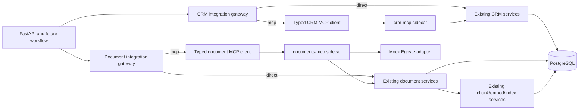

# Milestone 4 MCP Enterprise Boundaries Design

**Status:** Approved in conversation on 2026-07-14. Three independent review
rounds were completed; the owner resolved the final M2 compatibility issue by
confirming metadata-only chunk version refresh for unchanged extracted content.

**Milestone:** 4 — MCP enterprise boundaries

**Authoritative scope:** Modules 9 and 10 in
`docs/FINAL_IMPLEMENTATION_PLAN.md`, subordinate to the latest user instructions,
the supplied master prompt and repository `AGENTS.md`.

## 1. Goal

Introduce real, locally runnable Model Context Protocol boundaries for CRM and
document access without rewriting the existing domain services. The result must
remain fully usable without paid services, public network access or enterprise
credentials, while proving typed tool contracts, allowlists, timeouts, health,
audit, safe read fallback and approval-gated side effects.

Milestone 4 is complete only when both MCP integrations run through the official
SDK, the stopped-service and approval gates pass, new document content becomes
searchable after sync/index, the mandatory milestone checkpoint is green, and
the milestone is committed. Written code alone is not completion.

## 2. Non-goals

M4 does not:

- implement LangGraph or change the synchronous workflow into a graph;
- change scoring, recommendation, drafting or email approval behavior;
- add product UI for MCP configuration, document sync or capability approval;
- connect to a real CRM, Egnyte tenant or external identity provider;
- make MCP the default runtime mode;
- add a public HTTP endpoint that can issue side-effect approvals;
- log or audit full CRM notes, full documents, capability tokens or raw MCP
  responses;
- redesign existing public API response shapes.

LangGraph integration is M5, scoring/drafting/approval workflow changes are M6,
and complete frontend flows are M7.

## 3. Confirmed decisions

The repository owner confirmed the following decisions during design:

1. Implement both optional CRM write tools, but keep all side-effecting MCP
   tools disabled by default and approval-gated when enabled.
2. Run `crm-mcp` and `documents-mcp` as separate local Streamable HTTP services.
3. Permit automatic direct fallback for reads only. Writes fail closed and
   never automatically retry or fall back to direct execution.
4. Issue short-lived, signed, single-use capability tokens only through a local
   operator CLI. Do not expose a public approval-issuance API in M4.
5. Back the document server with a server-owned, read-only mock Egnyte root.
   Missing files do not imply deletion; only an explicit `inactive` manifest
   state causes soft deletion.
6. Use the official stable MCP Python SDK v1 Streamable HTTP APIs. Pin
   `mcp==1.28.1` and retain an explicit `<2` compatibility boundary in project
   documentation; v2 pre-releases are out of scope.

The SDK and transport choice follow the official
[MCP Python SDK](https://github.com/modelcontextprotocol/python-sdk),
[MCP transport specification](https://modelcontextprotocol.io/specification/draft/basic/transports)
and the [stable PyPI release](https://pypi.org/project/mcp/1.28.1/).

## 4. Architecture

### 4.1 Gateways

CRM and documents each receive one application-facing gateway with a typed
interface. The gateway selects `direct` or `mcp` from settings and owns fallback,
safe error classification and audit. Callers must not branch on transport.

The direct adapters wrap existing services and repositories. They preserve the
current behavior and also provide the fallback implementation. The MCP adapters
use typed clients and validate every result before returning it to callers.

### 4.2 MCP services

`crm-mcp` and `documents-mcp` are independent stateless Streamable HTTP
services with JSON responses. Each service:

- uses the same Pydantic contracts as its client;
- exposes only its documented tools;
- creates a database session per tool call;
- delegates domain behavior to shared application services rather than
  duplicating business rules;
- returns structured safe errors, never raw exceptions;
- has a non-MCP process health endpoint for container liveness while MCP
  readiness is verified through initialization and tool discovery.

One service stopping must not stop or degrade the other service.

### 4.3 Client transport controls

MCP endpoints come only from server configuration. No API request may provide a
URL, host, command or transport option. The client validates scheme, exact host,
port and `/mcp` path against configuration; disables environment proxy use and
redirects; applies connection and overall timeouts; and bounds read retries.

The default remains `direct`. MCP mode is explicitly enabled per integration.
The default Compose configuration remains unchanged; a separate MCP profile or
override starts the two services.

## 5. Typed MCP contracts

All tool input and output models use strict Pydantic configuration with unknown
fields forbidden. IDs must be positive; strengths and sentiment are bounded;
timestamps are timezone-aware; strings, lists and result counts have explicit
limits. The client lists tools after initialization and requires its mandatory
tool set. Additional discovered tools are reported but never called. Read tools
are always mandatory. Write tools are registered and required only when that
sidecar's write configuration is enabled. When writes are disabled, the client
rejects write requests locally with `writes_disabled` and the server does not
advertise write tools. A client/server discovery mismatch degrades health and
never broadens the client allowlist.

### 5.1 CRM tools

Read tools:

1. `get_company_contacts(company_id, limit)`
   - Returns bounded `ContactRead` records ordered by relationship strength.
2. `get_company_interactions(company_id, since, limit)`
   - Returns bounded `CRMInteractionRead` records ordered newest first.
3. `get_relationship_summary(company_id)`
   - Returns company ID, primary contact ID, contact/interaction counts, most
     recent interaction timestamp, average sentiment and strongest relationship
     value.
   - It does not return full raw CRM payloads.

Write tools, disabled by default:

4. `create_crm_note`
   - Accepts company/contact IDs, a bounded note summary, timestamp, sentiment,
     idempotency key and approval token.
   - Persists a `CRMInteraction` with the canonical note interaction type and
     returns the created or prior idempotent interaction ID and status. The
     authoritative MCP name is preserved; no `record_interaction` alias is
     exposed.
5. `update_relationship_strength`
   - Accepts contact ID, new bounded strength, idempotency key and approval token.
   - Returns contact ID, previous/new values and status.

### 5.2 Document tools

Read tools:

1. `list_company_documents(company_id, include_inactive, limit)`
   - Returns bounded document summaries.
2. `get_document_metadata(document_id)`
   - Returns metadata without document content.
3. `get_document_content(document_id)`
   - Returns bounded, already extracted text plus identity/hash/version metadata.
   - It never returns arbitrary file paths or original file bytes.

Write tools, disabled by default:

4. `sync_company_documents(company_id, idempotency_key, approval_token)`
   - Synchronizes only the configured mock source for the requested company.
   - Returns created, updated, unchanged, inactivated and failed counts plus
     document IDs and safe error categories.
5. `index_company_documents(company_id, document_ids, provider,
   idempotency_key, approval_token)`
   - Indexes only active documents belonging to the company.
   - Returns indexed/skipped counts, chunk count, model identities, document IDs
     and safe provider failures.

## 6. Public compatibility and integration adoption

Existing CRM and document HTTP response bodies remain compatible.

- Company-scoped CRM and document reads use the integration gateways, so MCP
  mode is exercised through existing API boundaries.
- Existing list endpoints without `company_id` remain direct compatibility
  paths because the authoritative MCP tools are company-scoped. Their audit
  record identifies `direct_unscoped_compatibility`.
- Existing document-by-ID reads use the document gateway and MCP contract.
- The current synchronous `AgentRunService` is not converted to asynchronous
  MCP orchestration in M4. M5 graph nodes consume the gateways built here.
- Current repository and service APIs remain available for direct adapters and
  tests; no feature is removed merely to enforce the new boundary.

## 7. Read fallback and write failure semantics

### 7.1 Reads

Read calls receive a small bounded retry budget for connection failures,
timeouts and explicitly retryable service failures. After exhaustion, or after
tool-set/result validation failure, the gateway uses the direct adapter and
returns the compatible result with internal fallback metadata for health,
audit and future graph warnings.

Fallback never trusts an invalid MCP partial result. The entire result is
discarded before direct execution.

### 7.2 Writes

Writes have no automatic retry and no direct fallback. This prevents duplicate
side effects when a server completed an operation but its response was lost.
Unknown tools, disabled tools, invalid results, timeout, invalid approval and
parameter mismatch all fail closed.

Every write requires an idempotency key even though the client will not retry.
Operators use the approval/execution record to determine whether a new approval
is safe after an ambiguous result.

The shared safe error category enum is closed and contains:
`not_configured`, `tool_not_allowed`, `tool_missing`,
`transport_unavailable`, `transport_timeout`, `protocol_error`,
`invalid_response`, `direct_fallback_failed`, `writes_disabled`,
`approval_missing`, `approval_invalid`, `approval_expired`,
`approval_reused`, `approval_argument_mismatch`, `idempotency_in_progress`,
`idempotency_conflict`, `idempotency_failed`, `unsafe_path`,
`unsupported_extension`, `mime_mismatch`, `file_too_large`,
`extracted_content_too_large`, `unsafe_archive`, `encrypted_document`,
`extraction_failed`, `sync_failed`, `index_failed`, `database_unavailable` and
`internal_error`. MCP results, approval/execution records, gateway fallback
metadata, health details and audit use only these categories; unexpected
exceptions map to `internal_error` without raw text.

## 8. Side-effect approvals and idempotency

### 8.1 Database records

Migration `0005_milestone4_mcp_boundaries` adds:

- `integration_action_approvals` with approval ID, integration, tool name,
  arguments digest, idempotency key, approved-by label, issued/expiry/executing/
  consumed timestamps, status and safe failure category;
- `integration_action_executions` with integration, tool name, idempotency key,
  arguments digest, status, safe result references and timestamps;
- nullable `documents.source_file_hash` for raw source-byte identity; legacy
  rows remain null until they are synchronized from a validated source file;
- the indexes and constraints required for expiry scans, single-use transitions
  and unique `(integration, tool_name, idempotency_key)` execution identity.

No full tool arguments or capability token is persisted. Status values are
constrained to documented lifecycle states. Both tables have additive upgrade
and downgrade paths.

Approval states are exactly `approved`, `executing`, `consumed`, `failed` and
`expired`. Allowed transitions are `approved -> executing -> consumed`,
`approved -> executing -> failed`, `approved -> expired`, and
`approved -> failed` for a trusted-token argument/tool/idempotency rejection.
The single additional transition `approved -> consumed` is allowed only when a
matching prior `succeeded` execution is returned without rerunning the side
effect. Terminal states never transition. An invalid signature cannot authorize
a row transition, but its rejection is audited without token material.

Execution states are exactly `executing`, `succeeded` and `failed`. A new
execution starts at `executing` and may transition once to `succeeded` or
`failed`; terminal executions never transition. There is no separate
`completed` state. `consumed` belongs only to approval records and `succeeded`
belongs only to execution records.

### 8.2 Capability construction

Every write tool defines two models: a token-free canonical arguments model and
an execution envelope containing `arguments` plus `approval_token`. The
approval CLI reads a JSON file and validates it against the token-free model,
canonicalizes that model's JSON and computes a SHA-256 digest. It then constructs
the execution envelope only after the approval row and token exist. The token
contains approval ID, integration, tool, digest, idempotency key and expiry and
is signed with HMAC-SHA256.

The signing key comes from `MCP_APPROVAL_SIGNING_KEY`, must meet a minimum
length, and is never stored or logged. The default write-disabled runtime does
not require a signing key. Enabling writes without a valid key makes the write
capability `not_configured` and rejects every write.

The CLI has `issue` and read-only `status` commands. `issue` requires an approver
label, a bounded expiry and an explicit interactive confirmation. It prints the
token once to standard output. `status` reports only lifecycle state, safe
category, timestamps and safe result references. Neither command exposes a
public approval API.

### 8.3 Atomic execution

Before invoking a side effect, the server:

1. verifies signature, expiry, integration and tool;
2. recomputes and constant-time compares the arguments digest;
3. locks the approval row and requires `approved` status;
4. checks the unique execution identity;
5. if no execution exists, inserts it and commits the approval and execution as
   `executing` in one reservation transaction;
6. invokes the shared domain service in a new database transaction;
7. commits the business mutation, safe result references, execution
   `succeeded` and approval `consumed` in that same transaction.

Shared write-domain services used here must support caller-owned transaction
boundaries and must not commit internally. Existing scripts may retain a thin
wrapper that commits after the service returns. This is required so a CRM or
document/index mutation cannot commit independently from its execution and
approval terminal states.

If the domain transaction raises, a separate failure transaction changes the
reserved execution and approval from `executing` to `failed`. If the process
crashes, the durable `executing` reservation remains intentionally ambiguous;
it is never auto-retried or auto-failed. The operator inspects it with CLI
`status` before issuing a different idempotency key.

Concurrent reuse is rejected. If a prior execution is `executing` or `failed`,
the new approval becomes `failed` with `idempotency_in_progress` or
`idempotency_failed`; no side effect occurs. A prior `succeeded` execution may
return its safe result only when integration, tool, key and digest all match and
the caller presents a separately valid approval. The server atomically marks
that new approval `consumed`, links it to the prior execution, and does not run
the side effect again. A digest mismatch marks a trusted approval `failed` with
an always deterministic category: `approval_argument_mismatch` means the
presented token-free arguments differ from the digest signed into that approval;
`idempotency_conflict` means those arguments match their approval but a prior
execution with the same integration/tool/idempotency key has a different
digest. Both are always rejected.

## 9. Mock Egnyte document source

The document server reads a server-owned root configured by
`DOCUMENT_MCP_ROOT`. The checked-in default contains only synthetic data and a
strict manifest. The directory is mounted read-only in containers.

Clients provide business identifiers only. They cannot provide a path, glob,
URL, selector or MIME type. Every manifest path is resolved and proven to remain
under the configured root; symlinks and special files are rejected.

Manifest entries include company identity, external ID, relative path, title,
document type, declared MIME, file version, source timestamp and state
(`active` or `inactive`). A missing entry or missing mount never deletes a
database row. Only an explicit, validated inactive entry soft-deletes the row
and removes its chunks.

### 9.1 Safe extraction

Global configurable defaults:

- maximum raw file size: existing `MAX_UPLOAD_BYTES` default, 10 MB;
- maximum extracted text: 2,000,000 characters;
- PDF page limit: 250;
- DOCX ZIP entry limit: 1,000;
- DOCX maximum total uncompressed size: 50 MB;
- DOCX maximum single entry: 10 MB;
- DOCX maximum compression ratio: 100:1.

The accepted extension/MIME/encoding allowlist is exact:

- `.txt`: `text/plain`, decoded only as UTF-8 or UTF-8 with BOM
  (`utf-8-sig`), with invalid byte sequences and NUL bytes rejected;
- `.pdf`: `application/pdf`, beginning with `%PDF-`, not encrypted;
- `.docx`:
  `application/vnd.openxmlformats-officedocument.wordprocessingml.document`,
  beginning with a ZIP signature and containing bounded
  `[Content_Types].xml` and `word/document.xml` entries.

No other extension, declared MIME or encoding is accepted. DOCX entry
traversal, absolute paths, symlinks, external relationships, embedded objects,
macros and encrypted archives are rejected. XML parsing uses hardened parsing.
Crossing the extracted-text limit rejects the entire file with
`extracted_content_too_large`; content is never silently truncated and no
partial document is persisted or indexed.

The implementation will use pinned, maintained extraction libraries compatible
with Python 3.12. Dependency installation requires explicit owner approval and
must pass `pip check`. Automated tests use only local synthetic fixtures.

### 9.2 Sync and index identity

The sync service calculates two identities. `source_file_hash` is SHA-256 over
the exact raw file bytes and records source-file change. Existing
`content_hash` remains the canonical hash of normalized extracted text and
controls chunk/index staleness. Migration 0005 adds nullable
`source_file_hash` without changing M2 cohort identity. Existing rows remain
null until a real validated source file is synchronized; the migration does not
fabricate a raw-file hash from extracted text.

Sync compares `external_id`, `file_version`, `source_file_hash` and
`content_hash`:

- new identity: create;
- same version/hash: unchanged;
- changed source file/version with changed normalized `content_hash`: update the
  document and mark every cohort stale for normal re-chunk/re-embedding;
- changed `file_version` with unchanged normalized `content_hash`: update the
  document and atomically refresh `source_file_version` on every active existing
  chunk without re-chunking or recomputing embeddings; the document and chunks
  must never commit with mismatched versions;
- changed raw `source_file_hash` with unchanged normalized content and unchanged
  version: update source metadata without changing chunk identity;
- explicit inactive: soft-delete and remove chunks;
- unsafe or malformed entry: reject that entry with a safe category.

Indexing operates only on active, successfully synced documents and replaces
only stale cohorts. A successful sync followed by index must make the document
retrievable through company-scoped RAG. Repeated sync/index with unchanged input
must not create duplicate rows or chunks.

## 10. Health and audit

Integration health performs real MCP initialization and tool discovery with a
short timeout. It does not merely echo settings.

A healthy integration configured in `direct` mode does not initialize or probe
MCP. It probes the direct database/service path and reports `ok` with mode
`direct`, preserving the existing default health contract. The statuses below
apply when that integration is configured in `mcp` mode.

- `ok`: connection, initialization and required tools are available;
- `degraded`: configured MCP is unavailable/invalid but read fallback works;
- `unavailable`: neither MCP nor direct read path is usable;
- `not_configured`: mode, endpoint, write enablement or signing configuration is
  incomplete.

Health reports CRM and documents independently and identifies direct, MCP and
fallback mode without exposing endpoints, credentials or raw errors.

Every call writes an existing `audit_logs` record containing only integration,
tool, mode, duration, outcome, arguments digest, bounded counts, entity IDs,
fallback category and safe error category. Audit must never include full CRM
notes, document text, capability tokens, signing keys, MCP raw payloads or raw
exception messages.

## 11. Configuration and deployment

Tracked example configuration documents, without real values:

- `CRM_INTEGRATION_MODE=direct|mcp`
- `DOCUMENT_INTEGRATION_MODE=direct|mcp`
- `CRM_MCP_ENDPOINT`
- `DOCUMENT_MCP_ENDPOINT`
- `MCP_CONNECT_TIMEOUT_SECONDS`
- `MCP_CALL_TIMEOUT_SECONDS`
- `MCP_READ_MAX_RETRIES`
- `MCP_READ_FALLBACK_ENABLED`, default `true` in every environment; operators
  may set `false` to require MCP reads to fail closed, in which case health is
  `unavailable` rather than `degraded` when MCP fails;
- `CRM_MCP_WRITES_ENABLED`
- `DOCUMENT_MCP_WRITES_ENABLED`
- `MCP_APPROVAL_TTL_SECONDS`
- `MCP_APPROVAL_SIGNING_KEY` as an uncommented name with no real value only if
  repository secret policy permits; otherwise document the name in comments;
- `DOCUMENT_MCP_ROOT` and extraction bounds.

Compose adds optional `crm-mcp` and `documents-mcp` services. They use the same
API image/code and database, separate commands and health checks. The document
root is read-only. Host ports are configurable and tests use an isolated Compose
project, database identities, ports, network and volume. Default Compose does
not start MCP services unless explicitly enabled.

## 12. Test strategy

### 12.1 Unit tests

- strict CRM/document tool schemas and result validation;
- settings and exact endpoint validation;
- tool allowlist and missing/extra tool behavior;
- canonical argument digest and constant-time token verification;
- expiry, tamper, tool/argument mismatch and single-use state transitions;
- direct gateway behavior and read fallback categorization;
- manifest validation, path/symlink boundaries and explicit inactive semantics;
- TXT/PDF/DOCX signature, MIME, size, page/ZIP/ratio and extraction limits;
- sync identity and index-staleness decisions.

### 12.2 Integration tests

- official SDK client/server initialization and Streamable HTTP tool calls;
- CRM contacts, interactions and relationship summary through MCP;
- MCP-backed existing company-scoped HTTP routes with compatible responses;
- stopped server, timeout, server error and invalid-result read fallback;
- unknown tool and request-provided endpoint rejection;
- writes disabled by default;
- invalid, expired, reused, concurrent and argument-mismatched approval tokens;
- exactly-once CRM write and safe prior-result handling;
- document initial/repeated/content-changed/inactive sync;
- version-only sync proves metadata-only chunk version refresh, no new
  embeddings/chunks and continued company-scoped retrieval;
- approved indexing followed by company-scoped RAG retrieval;
- write timeout/error proof that no direct fallback occurred;
- health status transitions and redacted audit evidence.

No automated test uses the public network, a real CRM, Egnyte, paid API or real
credential.

### 12.3 Migration and full-stack checkpoint

Revision 0005 must pass clean upgrade, M3-to-M4 upgrade, downgrade/re-upgrade,
data preservation, constraint/index inspection, ORM metadata comparison and
`alembic check` against an isolated test database.

The disposable Compose gate must prove:

1. both sidecars are healthy;
2. live SDK-backed reads work;
3. stopping one sidecar degrades only that integration and reads fall back;
4. a valid approval performs one write and reuse is rejected;
5. document sync is idempotent;
6. newly indexed content is retrievable through RAG;
7. write failures never use direct fallback;
8. logs and audits contain no secret or full sensitive content;
9. teardown removes only the disposable project and the default environment is
   unchanged.

The final M4 checkpoint also runs all new unit and integration tests, all
existing backend regressions, coverage, backend compilation, `pip check`,
frontend lint, TypeScript, production build, Compose configuration/build,
`git diff --check` and staged deletion/secret/dead-code/unrelated-change review.
Exact commands and pass/fail/skip counts are recorded in
`docs/IMPLEMENTATION_STATUS.md`.

## 13. Definition of Done

M4 is complete only when:

- CRM and document MCP servers are real independent Streamable HTTP services;
- typed clients validate initialization, allowlists and results;
- direct mode remains the default and existing public responses remain
  compatible;
- company-scoped reads work over MCP and stopped-server reads fall back with
  explicit health/audit evidence;
- every side-effect tool is disabled by default and requires an exact,
  short-lived, single-use approval capability when enabled;
- writes never retry or fall back automatically;
- document TXT/PDF/DOCX safety controls, idempotent sync, explicit inactivation,
  incremental indexing and RAG visibility are tested;
- migration 0005 and the full mandatory checkpoint pass with zero required
  skips;
- ADR, implementation plan/status and both public READMEs are synchronized;
- the M4 implementation is committed on `main` only after the gate passes;
- M5 has not started.
